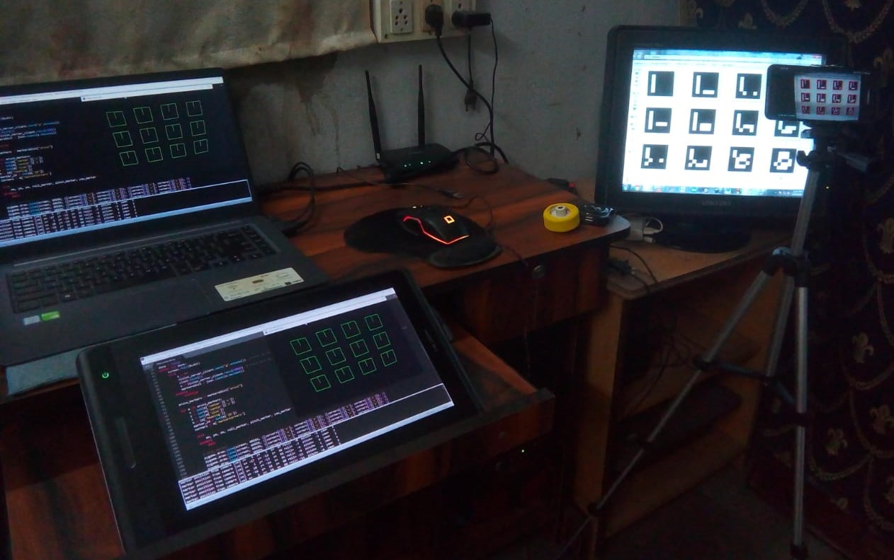

# ArUco-Nav

### Localization and visual navigation of a scalable robot swarm using ArUco markers.

Localization of ArUco markers -


Swarm navigation simulated in a pygame window -


For simulating the navigation and logging the results, a simple 15 seconds scene was arranged with 3 swarm robots (indicated by their green bounding boxes and their
ArUco marker IDs) and 4 barrier points (indicated by red bounding boxes).

ArUco-Nav setup -


A total of 60 frames were recorded and scanned at the rate of 8fps using the overhead smart phone camera running ```ArUco Scanner``` server at ```192.168.2.2:5000```.
The response obtained from the server was processed to log the marker (and hence, the robot) orientation in 2D space (using the tvec and rvec components - xm, ym, zm, roll,
pitch and yaw).

The final simulation as shown in the pygame window ```ArUco
Scanner Nav Sim``` -


### Using ArUco-Nav

From the command line, execute the following:

```bash
# Clone this repository
$ git clone https://github.com/ArUco-Nav-Final-Year-Project-20/ArUco-Nav.git/
```
```bash
# Go into the repository
$ cd ArUco-Nav/
```
```bash
# Install dependencies
$ pip install numpy
$ pip install opencv-contrib-python
$ pip install simple-pid
```
Calibrate the camera and replace the contents of the ```cameraMatrix.txt``` and ```distortionCoefficients.txt``` files inside the ```camera_calibration_config``` folder with the appropriate intrinsic parameter values.

Launch the ArUco Scanner app and replace the ```aruco_vision_server_IP``` address with the one obtained from the application screen.


```bash
# Localize ArUco markers
$ python aruco_nav_sim.py
```
